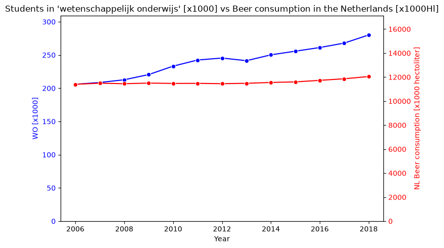

### Solution markdown file by Oskar Bosgraaf, 13220977

#### Tiny little bibliography:
- MCC Van Dyke et al., 2019
- JT Harvey, Applied Ergonomics, 2002
- DW Wiegler et al., 2005

Whilst we see both the number of WO students increasing, as well as the number of beer consumed increasing, these do not scale proportionally to each other.